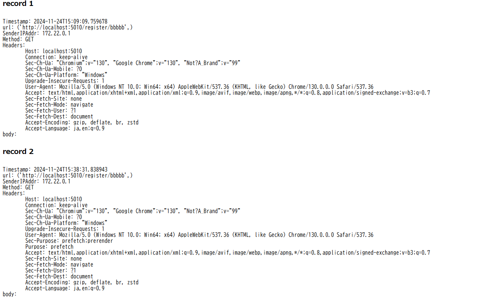

# HTTP Request Wacher
[](https://www.python.org)


## Overview
HTTP Request Wacher is a site for collecting HTTP metadata such as headers and body information.
The site is for Web API developers and Web CTF players.

this siteThere are following two features in this site: 
1. Collects HTTP header and body information when an HTTP GET/POST is recieved.
2. Allows users to view the collected header and body information.

It is strongly recommended to deploy this repository on cloud services such as  AWS for security reasons.  
Additionally, this repository does not currently support HTTPS. 
Support may be added upon request.

## Table of Contents
- [Overview](#overview)
- [Table of Contents](#table-of-contents)
- [Installation](#installation)
- [How to Use the Site](#how-to-use-the-site)
  - [How to Collect HTTP Metadata](#how-to-collect-http-metadata)
  - [How to View HTTP Metadata](#how-to-view-http-metadata)
- [License](#license)


## Installation
1. clone this repository.
```bash
git clone https://github.com/RyuichiHashimoto/HTTPRequestWatcher.git
```

2. build a docker container by following commands.

```bash
cd HTTPRequestWatcher
docker compose up -d --build
```

After bulding the docker container, you can access the site.

## How to Use the Site
### How to Collect HTTP Metadata
Access the URL
```http://{ip-iddr}/register/{session-id}```

Note:
- The session-id must consist of alphanumeric characters (lowercase only). 
- Only HTTP GET and POST methods are collected.


### How to View HTTP Metadata
Access the URL:
```http://{ip-iddr}/view/{session-id}```にアクセスする。

Upon accessing the URL, you will obtain HTTP metadata (e.x. the following image).




## License
This project is licensed under the MIT License.

